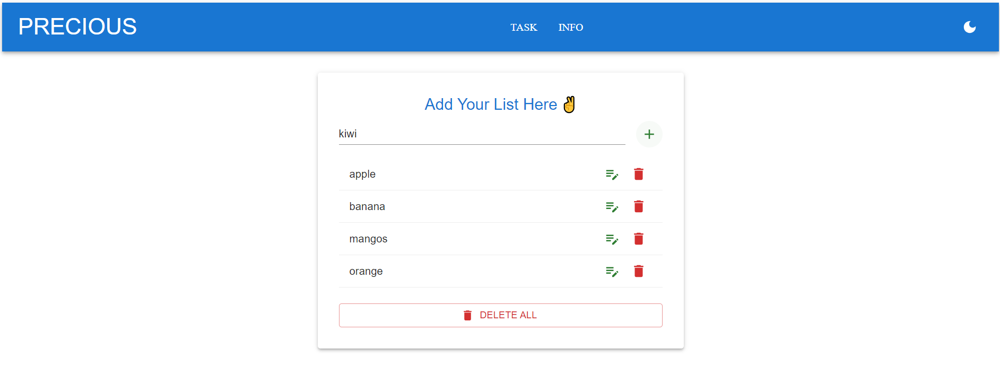

<!-- # React + Vite

This template provides a minimal setup to get React working in Vite with HMR and some ESLint rules.

Currently, two official plugins are available:

- [@vitejs/plugin-react](https://github.com/vitejs/vite-plugin-react/blob/main/packages/plugin-react/README.md) uses [Babel](https://babeljs.io/) for Fast Refresh
- [@vitejs/plugin-react-swc](https://github.com/vitejs/vite-plugin-react-swc) uses [SWC](https://swc.rs/) for Fast Refresh -->

TodoApp 

Features
Add Items: Users can add items to the todo list.
Edit Items: Users can edit existing items by clicking the edit button.
Delete Items: Users can remove individual items or clear the entire list.
Responsive Design: The app is responsive and user-friendly, styled with Material-UI components.
Persistent List: The list items remain visible even after page refresh (based on the current state).

Technologies Used
React: Frontend library used to build the user interface.
Material-UI: UI library for responsive and modern components.
React Testing Library: For unit testing the components.
Jest: Testing framework for running the tests.

Getting Started
Prerequisites
Node.js (>= 14.x)
npm

nstallation
Clone the repository:

git clone https://github.com/Sushil-lowanshi/precioustask
cd TodoApp

Install the dependencies:
Using npm:
npm install

Running the App
npm run dev

Testing the App
npm test

# My Project

This is my awesome project.

## Screenshots

### Home Page first look

### after clickd dark mode

### add item

### update item

### delete item

### delete all item

### task page

### description 1

### description 2

